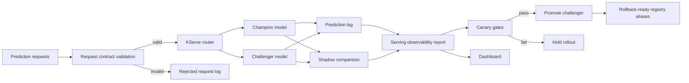

# KServe Model Serving Platform

A production-style model serving project focused on Kubernetes inference operations: champion/challenger rollout, shadow scoring, request contracts, idempotent predictions, canary gates, rollback, and observability.

The default demo is local-first and fast to run. The repo also includes KServe, Prometheus, and Minikube scaffolding for a production-shaped deployment path.


## What This Demonstrates

- KServe-style InferenceService deployment metadata
- Champion and challenger model aliases
- Canary traffic routing
- Shadow scoring for champion-routed requests
- Request validation with a documented prediction contract
- Idempotent prediction handling by `request_id`
- Structured prediction logs
- Latency, error rate, throughput, route mix, and score distribution monitoring
- Canary promotion gates
- Model rollback to previous champion
- Minikube/KServe migration notes

## Architecture



## Quick Start

```bash
make demo
make test
```

Open the generated dashboard:

```bash
open .local/reports/kserve_serving_dashboard.html
```

## Commands

```bash
make deploy      # create registry aliases and local KServe deployment state
make simulate    # generate and score synthetic prediction traffic
make monitor     # build observability report and canary decision
make promote     # promote challenger when canary gates pass
make rollback    # restore previous champion
make predict     # run one online request
make health      # inspect serving readiness
make minikube-up # print local cluster bootstrap commands
make test        # run unit and integration tests
```

## Production-Grade Refinements

See [production-grade refinements](docs/production-grade-refinements.md) for the KServe hardening, traffic policy, shadow scoring, canary gates, and rollback improvements.

For the latest progressive rollout orchestration pass, see [advanced orchestration assessment](docs/advanced-orchestration-assessment.md).

For the Kubernetes/Airflow robustness layer, see [Kubernetes and Airflow robustness](docs/kubernetes-airflow-robustness.md).

## Canary Gates

The challenger is recommended for promotion only when:

- p95 latency <= 35 ms
- error rate <= 1 percent
- mean shadow score delta <= 0.12
- challenger received live traffic

The demo keeps promotion as an explicit command. This models a real approval workflow: monitoring can recommend promotion, but deployment automation should still respect release policy.

## Local To Production Mapping

| Local artifact | Production analogue |
| --- | --- |
| `.local/registry/credit-risk/aliases.json` | MLflow aliases or registry stages |
| `.local/deployments/kserve_state.json` | KServe InferenceService status |
| `.local/logs/predictions.jsonl` | structured inference logs |
| `.local/reports/serving_observability.json` | Prometheus, OpenTelemetry, Evidently, or warehouse monitor |
| `kserve/inferenceservice-canary.yaml` | Kubernetes canary serving manifest |
| `kserve/rollback-patch.yaml` | emergency rollback manifest |
| `contracts/prediction_request_contract.yml` | serving API data contract |

## Production Notes

In a real deployment, the router would be implemented with KServe traffic splitting, a gateway, or a thin service layer in front of multiple InferenceServices. Prediction logs would include trace IDs, model version, request hash, route, latency, validation errors, and feature payload references.

The key production idea is that model serving is not only a REST endpoint. It is a release system with traffic policy, observability, rollback, and strict request contracts.

## Interview Talking Points

- Why canary promotion should depend on latency, errors, and score divergence.
- How shadow scoring differs from live challenger traffic.
- Why request IDs are required for idempotency.
- How KServe autoscaling can affect p95 and p99 latency.
- How MLflow aliases map to KServe storage URIs.
- What data must be logged to debug a bad model release.
