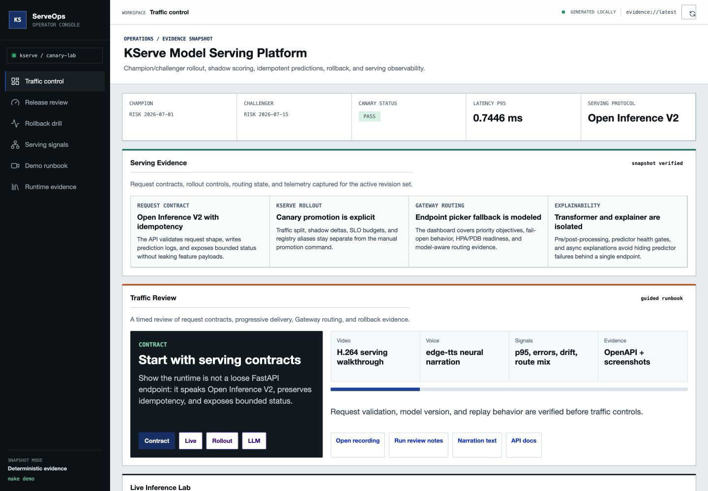
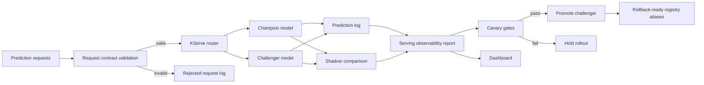

# KServe Model Serving Platform

[](https://github.com/kevinmeix1/kserve-model-serving-platform/actions/workflows/ci.yml)

A production-style model serving project focused on Kubernetes inference operations: champion/challenger rollout, shadow scoring, request contracts, idempotent predictions, canary gates, rollback, and observability.

The default demo is local-first and fast to run. The repo also includes KServe, Prometheus, and Minikube scaffolding for a production-shaped deployment path.



## What This Demonstrates

- KServe-style InferenceService deployment metadata
- Champion and challenger model aliases
- Canary traffic routing
- Shadow scoring for champion-routed requests
- Request validation with a documented prediction contract
- Idempotent prediction handling by `request_id`
- Structured prediction logs
- Latency, error rate, throughput, route mix, and score distribution monitoring
- Canary promotion gates
- Model rollback to previous champion
- Minikube/KServe migration notes

## Architecture



## Quick Start

```bash
make demo
make test
```

Open the generated dashboard:

```bash
open .local/reports/kserve_serving_dashboard.html
```

## Commands

```bash
make deploy      # create registry aliases and local KServe deployment state
make simulate    # generate and score synthetic prediction traffic
make monitor     # build observability report and canary decision
make promote     # promote challenger when canary gates pass
make rollback    # restore previous champion
make predict     # run one online request
make health      # inspect serving readiness
make minikube-up # print local cluster bootstrap commands
make test        # run unit and integration tests
```

## Production-Grade Refinements

See [production-grade refinements](docs/production-grade-refinements.md) for the KServe hardening, traffic policy, shadow scoring, canary gates, and rollback improvements.

For the latest progressive rollout orchestration pass, see [advanced orchestration assessment](docs/advanced-orchestration-assessment.md).

For the Kubernetes/Airflow robustness layer, see [Kubernetes and Airflow robustness](docs/kubernetes-airflow-robustness.md).

For the operator-facing rollout planner, see [advanced rollout control plane](docs/control-plane-depth.md).

For Airflow 3 rollout queue, shadow warmup, route convergence, and rollback Deadline Alerts with bounded callbacks, see [Airflow deadline alerts](docs/airflow-deadline-alerts.md).

For OpenCost serving unit economics, traffic-class budgets, GPU explainer spend, and allocation labels, see [cost observability and FinOps](docs/cost-observability.md).

For the policy-as-code audit layer, see [security and governance](docs/security-governance.md).

For OpenTelemetry-style runtime traces, see [observability and tracing](docs/observability-tracing.md).

For controlled failure injection and recovery objectives, see [resilience and chaos drills](docs/resilience-chaos.md).

For workload right-sizing, HPA/VPA guardrails, and Airflow pool sizing, see [resource optimization](docs/resource-optimization.md).

For runtime network boundaries, mTLS, and allow-listed service flows, see [network security](docs/network-security.md).

For auditable environment promotion with Argo CD and Argo Rollouts, see [GitOps promotion](docs/gitops-promotion.md).

For backup schedules, restore order, and RPO/RTO evidence, see [disaster recovery](docs/disaster-recovery.md).

For serving model cards, request data cards, canary approval records, risk controls, and reproducibility hashes, see [governance evidence](docs/governance-evidence.md).

For multi-window burn alerts, canary-freeze policy, and error-budget reports, see [SLO and error budget automation](docs/slo-error-budget.md).

For EKS Auto Mode, Terraform, managed-service mappings, and portability notes, see [cloud migration](docs/cloud-migration.md).

For GitHub artifact attestations, SLSA provenance, Sigstore policy-controller admission, and checksum evidence, see [supply chain provenance](docs/supply-chain-provenance.md).

For an automated scan of advanced Airflow, Kubernetes, lineage, scaling, GitOps, and security controls, see [orchestration scorecard](docs/orchestration-scorecard.md).

For GPU ResourceFlavors, Dynamic Resource Allocation notes, MIG/time-slicing trade-offs, and accelerator quota planning, see [accelerator scheduling](docs/accelerator-scheduling.md).

For DRA `DeviceClass`, `ResourceClaimTemplate`, Kueue admission coupling, and canary rollback fallback policy, see [dynamic resource allocation](docs/dynamic-resource-allocation.md).

For Kueue topology-aware serving analysis, LeaderWorkerSet co-location, and zone-spread router placement, see [topology-aware scheduling](docs/topology-aware-scheduling.md).

For RayService transforms, Kueue-admitted canary analysis, elastic worker bounds, and explainer fallbacks, see [KubeRay and Kueue](docs/kuberay-kueue.md).

For Kueue Workload Slices, JobSet shadow analysis, replacement slices, GPU explainers, and rollback quota recovery, see [Kueue elastic workloads](docs/kueue-elastic-workloads.md).

For Kubernetes Indexed Jobs, per-index retry budgets, `successPolicy`, `podFailurePolicy`, and Airflow 3 failed-only rollout recovery, see [indexed job resilience](docs/indexed-job-resilience.md).

For Kueue ProvisioningRequest admission checks that gate shadow analysis, rollback smoke tests, and GPU explainers without queuing online predictors, see [provisioning admission](docs/provisioning-admission.md).

For Kueue MultiKueue manager-to-worker dispatch of shadow replay, route conformance, rollback smoke, and GPU explainer jobs without queueing live predictors, see [MultiKueue dispatch](docs/multikueue-dispatch.md).

For KServe LocalModelCache, modelcar OCI storage, cache-gated canaries, and rollback preloading, see [local model cache](docs/model-cache.md).

For Airflow 3 GitDagBundle configuration, DAG versioning, scheduler-managed backfills, and canary incident replay semantics, see [Airflow DAG Bundles](docs/airflow-dag-bundles.md).

For model-aware routing with Gateway API Inference Extension, stable `InferencePool`, Endpoint Picker fallback, and priority objectives, see [Gateway API Inference Extension](docs/inference-gateway.md).

For portable OpenTelemetry attributes, GenAI token/cost fields, Kubernetes correlation, and telemetry redaction guardrails, see [semantic telemetry](docs/semantic-telemetry.md).

For serving tenant quotas, Kueue cohorts, Airflow pools, rollback reservations, chargeback labels, and noisy-neighbor controls, see [multi-tenant fairness](docs/multi-tenant-fairness.md).

For projected service-account tokens, External Secrets, SPIFFE identities, and keyless KServe/Airflow access, see [workload identity](docs/workload-identity.md).

For p95/p99 serving latency, canary-volume, shadow-delta, and rollback regression gates, see [performance budgets](docs/performance-budgets.md).

For Kueue quota pressure, serving priority, rollback preemption, GPU use, and Airflow pool examples, see [queue capacity simulation](docs/queue-capacity-simulation.md).

For fail-closed canary decisions that combine rollout state, SLOs, queue admission, governance, provenance, and rollback capacity, see [release admission control](docs/release-admission-control.md).

## Canary Gates

The challenger is recommended for promotion only when:

- p95 latency <= 35 ms
- error rate <= 1 percent
- mean shadow score delta <= 0.12
- challenger received live traffic

The demo keeps promotion as an explicit command. This models a real approval workflow: monitoring can recommend promotion, but deployment automation should still respect release policy.

## Local To Production Mapping

| Local artifact | Production analogue |
| --- | --- |
| `.local/registry/credit-risk/aliases.json` | MLflow aliases or registry stages |
| `.local/deployments/kserve_state.json` | KServe InferenceService status |
| `.local/logs/predictions.jsonl` | structured inference logs |
| `.local/reports/serving_observability.json` | Prometheus, OpenTelemetry, Evidently, or warehouse monitor |
| `kserve/inferenceservice-canary.yaml` | Kubernetes canary serving manifest |
| `kserve/rollback-patch.yaml` | emergency rollback manifest |
| `contracts/prediction_request_contract.yml` | serving API data contract |

## Production Notes

In a real deployment, the router would be implemented with KServe traffic splitting, a gateway, or a thin service layer in front of multiple InferenceServices. Prediction logs would include trace IDs, model version, request hash, route, latency, validation errors, and feature payload references.

The key production idea is that model serving is not only a REST endpoint. It is a release system with traffic policy, observability, rollback, and strict request contracts.

## Interview Talking Points

- Why canary promotion should depend on latency, errors, and score divergence.
- How shadow scoring differs from live challenger traffic.
- Why request IDs are required for idempotency.
- How KServe autoscaling can affect p95 and p99 latency.
- How MLflow aliases map to KServe storage URIs.
- What data must be logged to debug a bad model release.
