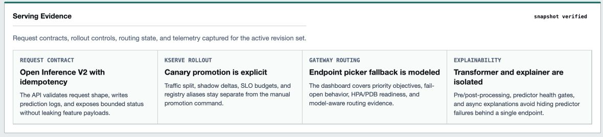
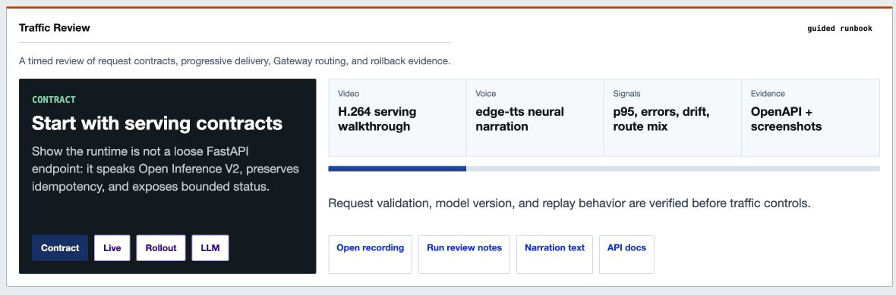
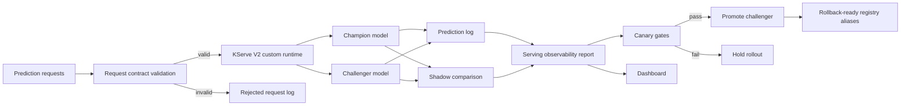
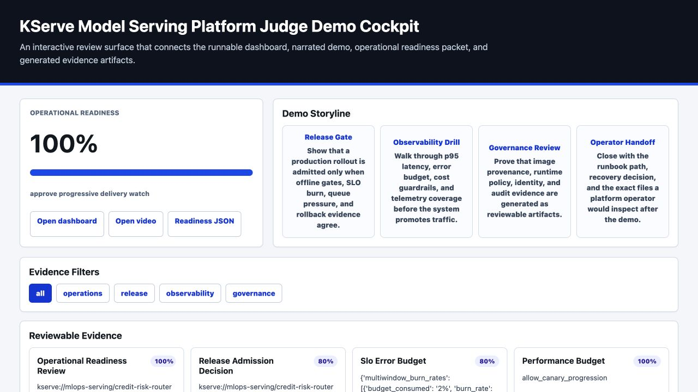
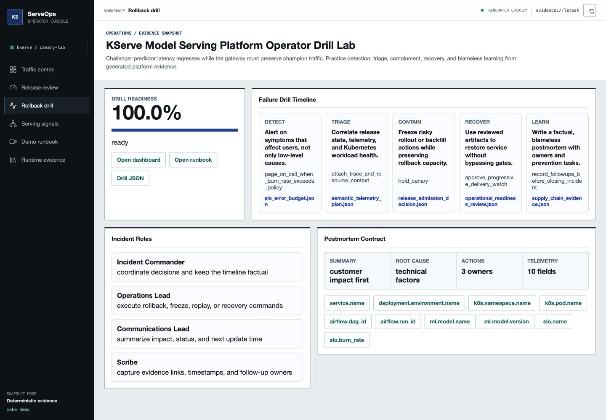
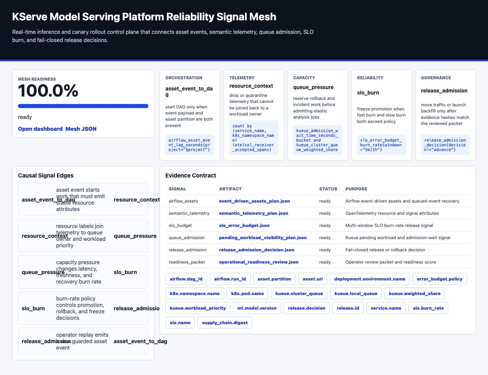
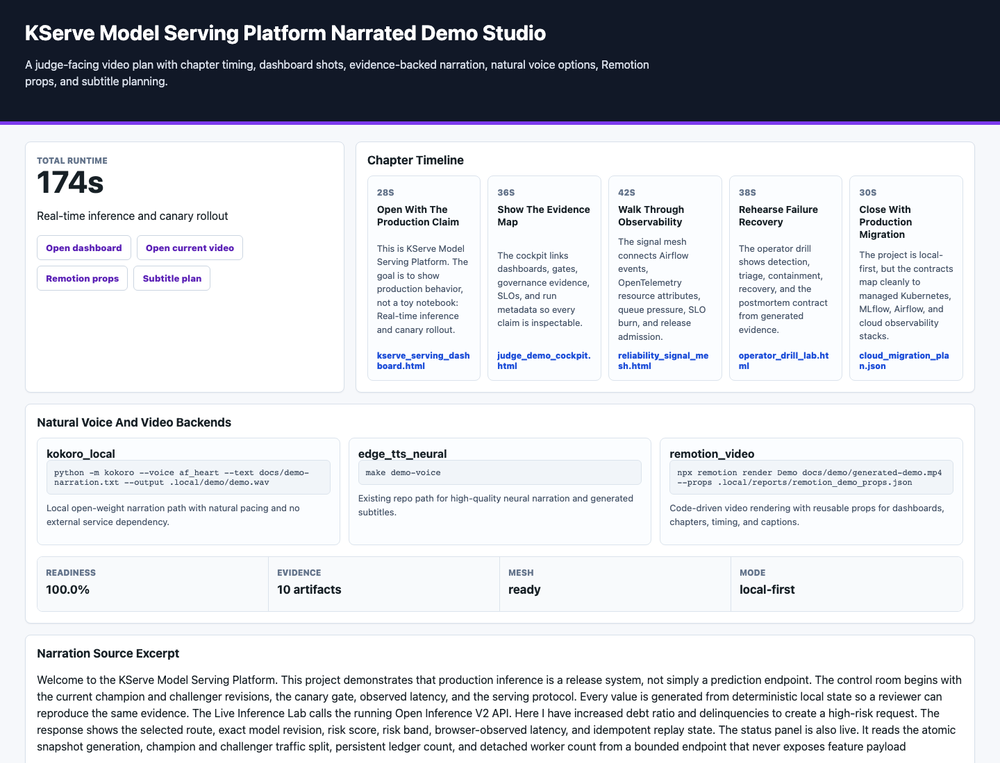

# KServe Model Serving Platform

[](https://github.com/kevinmeix1/kserve-model-serving-platform/actions/workflows/ci.yml)

A production-style model serving project focused on Kubernetes inference operations: a runnable KServe V2 data plane, champion/challenger rollout, shadow scoring, request contracts, durable idempotency, canary gates, rollback, and observability.

The deterministic demo is local-first and fast to run. A containerized FastAPI runtime exposes the same model state through the Open Inference Protocol, while the KServe, Prometheus, and Minikube assets show the cluster deployment path.


[Watch the narrated judge demo](docs/demo/kserve-judge-demo.mp4) or follow the [five-minute demo runbook](docs/judge-demo.md). A verified mobile capture is available at [docs/screenshots/dashboard-mobile.png](docs/screenshots/dashboard-mobile.png), the LLM readiness dashboard capture is at [docs/screenshots/dashboard-llm-readiness.png](docs/screenshots/dashboard-llm-readiness.png), and the Transformer/Explainer readiness capture is at [docs/screenshots/dashboard-transformer-explainer.png](docs/screenshots/dashboard-transformer-explainer.png).

For a study-oriented walkthrough with the full architecture diagram,
step-by-step screenshot guide, code reading order, and interview explanations,
start with [the project study guide](docs/study-guide.md).





## What This Demonstrates

- Runnable KServe Open Inference Protocol V2 HTTP runtime
- Batched and version-pinned inference with strict tensor contracts
- Atomic last-known-good model snapshots during alias promotion
- Durable request idempotency across process restarts
- Durable single-flight claims for concurrent same-ID retries
- Bounded concurrency, queue budgets, and inference deadlines
- Capacity-safe timeout handling with eventual idempotent replay
- KServe InferenceService deployment metadata and custom runtime manifest
- Champion and challenger model aliases
- Canary traffic routing
- Shadow scoring for champion-routed requests
- Request validation with a documented prediction contract
- Idempotent prediction handling by `request_id`
- Structured prediction logs
- Interactive inference lab backed by the live Open Inference V2 endpoint
- Payload-free console status API for snapshot, ledger, and worker evidence
- Generative inference readiness plan for KServe `LLMInferenceService`, vLLM, OCI ModelCar artifacts, endpoint picking, and TTFT/TPOT gates
- Predictor/Transformer/Explainer topology readiness with transformer predictor-health gates, async explainer scaling, bounded sync latency, and fallback routes
- Latency, error rate, throughput, route mix, and score distribution monitoring
- Canary promotion gates
- Model rollback to previous champion
- Minikube/KServe migration notes

## Architecture



## Quick Start

```bash
make demo
make test
```

Open the generated dashboard:

```bash
open .local/reports/kserve_serving_dashboard.html
open .local/reports/judge_demo_cockpit.html
open .local/reports/operator_drill_lab.html
open .local/reports/reliability_signal_mesh.html
open .local/reports/narrated_demo_studio.html
```

The judge demo cockpit is the fastest portfolio review path: it links the
serving dashboard, narrated video, operational readiness packet, and generated
evidence artifacts behind interactive release, observability, governance, and
operator-handoff filters.



The Operator Drill Lab rehearses detection, triage, containment, recovery, and
blameless postmortem follow-up from the generated serving evidence.



The Reliability Signal Mesh connects Airflow asset events, OpenTelemetry
resource attributes, Kueue admission pressure, SLO burn, and fail-closed release
decisions into one operator-facing evidence graph.



The Narrated Demo Studio turns the evidence bundle into a judge-facing chapter
timeline with natural voice backends, Remotion props, subtitle timing, and
evidence-linked visuals.



To run the actual HTTP serving boundary:

```bash
python3 -m venv .venv
.venv/bin/pip install -e '.[serving,test]'
make demo
make api-run
```

Open `http://127.0.0.1:8080/dashboard` while `make api-run` is active. The Live Inference Lab submits a real V2 request, shows champion/challenger routing, model version, risk score, browser-observed latency, snapshot generation, and idempotency evidence. The runtime status strip reads the bounded `/api/console/status` endpoint; it exposes operational counts and identifiers but no feature payloads or prediction bodies.

In another terminal, run `make api-smoke`. The container path is `make compose-up`; it serves the same interactive dashboard at `http://127.0.0.1:8080/dashboard` and the API contract at `/docs`.

## Commands

```bash
make deploy      # create registry aliases and local KServe deployment state
make runtime-init # initialize only the model, traffic, logs, and dashboard assets
make simulate    # generate and score synthetic prediction traffic
make monitor     # build observability report and canary decision
make promote     # promote challenger when canary gates pass
make rollback    # restore previous champion
make predict     # run one online request
make health      # inspect serving readiness
make api-run     # start the KServe V2-compatible HTTP runtime
make api-smoke   # verify health, metadata, batch inference, replay, and metrics
make llm-inference-readiness # generate KServe LLM/vLLM readiness evidence
make transformer-explainer-readiness # generate Predictor/Transformer/Explainer topology evidence
make test-api    # run serving data-plane contract tests
make lint-api    # lint the executable serving boundary
make verify-serving-lock # reject missing, extra, or version-drifted dependencies
make package-smoke # build with pinned tooling and verify an isolated wheel import
make kserve-schema-contract # validate the manifest against KServe 0.18
make compose-up  # build and start the reproducible container path
make compose-smoke # build, test, and tear down the container path
make minikube-up # print local cluster bootstrap commands
make test        # run unit and integration tests
```

## Production-Grade Refinements

See [production-grade refinements](docs/production-grade-refinements.md) for the KServe hardening, traffic policy, shadow scoring, canary gates, and rollback improvements.

For the executable Open Inference V2 server, atomic model snapshots, persistent idempotency, cancellation-safe deadlines, probe semantics, and container smoke gate, see [KServe V2 serving runtime](docs/kserve-v2-serving-runtime.md).

For the latest progressive rollout orchestration pass, see [advanced orchestration assessment](docs/advanced-orchestration-assessment.md).

For the Kubernetes/Airflow robustness layer, see [Kubernetes and Airflow robustness](docs/kubernetes-airflow-robustness.md).

For the operator-facing rollout planner, see [advanced rollout control plane](docs/control-plane-depth.md).

For Airflow 3 rollout queue, shadow warmup, route convergence, and rollback Deadline Alerts with bounded callbacks, see [Airflow deadline alerts](docs/airflow-deadline-alerts.md).

For OpenCost serving unit economics, traffic-class budgets, GPU explainer spend, and allocation labels, see [cost observability and FinOps](docs/cost-observability.md).

For the policy-as-code audit layer, see [security and governance](docs/security-governance.md).

For OpenTelemetry-style runtime traces, see [observability and tracing](docs/observability-tracing.md).

For serving-specific pod resource, DRA, Gateway route, and model identity telemetry contracts, see [AI workload telemetry readiness](docs/ai-workload-telemetry.md).

For the operator-facing packet that combines release admission, SLO burn, rollout, provenance, telemetry, and performance evidence, see [operational readiness review](docs/operational-readiness-review.md).

For controlled failure injection and recovery objectives, see [resilience and chaos drills](docs/resilience-chaos.md).

For workload right-sizing, HPA/VPA guardrails, and Airflow pool sizing, see [resource optimization](docs/resource-optimization.md).

For runtime network boundaries, mTLS, and allow-listed service flows, see [network security](docs/network-security.md).

For auditable environment promotion with Argo CD and Argo Rollouts, see [GitOps promotion](docs/gitops-promotion.md).

For backup schedules, restore order, and RPO/RTO evidence, see [disaster recovery](docs/disaster-recovery.md).

For serving model cards, request data cards, canary approval records, risk controls, and reproducibility hashes, see [governance evidence](docs/governance-evidence.md).

For multi-window burn alerts, canary-freeze policy, and error-budget reports, see [SLO and error budget automation](docs/slo-error-budget.md).

For EKS Auto Mode, Terraform, managed-service mappings, and portability notes, see [cloud migration](docs/cloud-migration.md).

For GitHub artifact attestations, SLSA provenance, Sigstore policy-controller admission, and checksum evidence, see [supply chain provenance](docs/supply-chain-provenance.md).

For an automated scan of advanced Airflow, Kubernetes, lineage, scaling, GitOps, and security controls, see [orchestration scorecard](docs/orchestration-scorecard.md).

For GPU ResourceFlavors, Dynamic Resource Allocation notes, MIG/time-slicing trade-offs, and accelerator quota planning, see [accelerator scheduling](docs/accelerator-scheduling.md).

For DRA `DeviceClass`, `ResourceClaimTemplate`, Kueue admission coupling, and canary rollback fallback policy, see [dynamic resource allocation](docs/dynamic-resource-allocation.md).

For Kubernetes v1.36 DRA `ResourceHealthStatus`, `ResourceClaim.status.devices`, and device quarantine during KServe canaries, see [DRA resource health status](docs/dra-resource-health-status.md).

For DRA prioritized alternatives, partitionable devices, consumable capacity, and binding-condition readiness for serving canaries, see [DRA advanced device sharing](docs/dra-advanced-device-sharing.md).

For Kubernetes v1.36 DRA `AdminAccess` diagnostics with KServe revision evidence, model-cache state, and rollback route guardrails, see [KServe DRA AdminAccess diagnostics](docs/dra-admin-access-diagnostics.md).

For Kubernetes v1.35 in-place Pod Resize, v1.36 pod-level resource resizing, KServe canary safety, and VPA `InPlaceOrRecreate` guardrails, see [KServe in-place Pod resize controls](docs/inplace-pod-resize.md).

For Kueue topology-aware serving analysis, LeaderWorkerSet co-location, and zone-spread router placement, see [topology-aware scheduling](docs/topology-aware-scheduling.md).

For RayService transforms, Kueue-admitted canary analysis, elastic worker bounds, and explainer fallbacks, see [KubeRay and Kueue](docs/kuberay-kueue.md).

For Kueue Workload Slices, JobSet shadow analysis, replacement slices, GPU explainers, and rollback quota recovery, see [Kueue elastic workloads](docs/kueue-elastic-workloads.md).

For Kubernetes Indexed Jobs, per-index retry budgets, `successPolicy`, `podFailurePolicy`, and Airflow 3 failed-only rollout recovery, see [indexed job resilience](docs/indexed-job-resilience.md).

For Kueue ProvisioningRequest admission checks that gate shadow analysis, rollback smoke tests, and GPU explainers without queuing online predictors, see [provisioning admission](docs/provisioning-admission.md).

For Kubernetes pod-level resource envelopes, stable scheduling gates, KServe cache readiness checks, and scheduler-churn metrics, see [pod resource envelopes](docs/pod-resource-envelopes.md).

For Kueue Fair Sharing, Admission Fair Sharing, serving queue weights, borrowing/lending limits, and preemption guardrails, see [Kueue cohort fair sharing](docs/kueue-cohort-fair-sharing.md).

For Kueue MultiKueue manager-to-worker dispatch of shadow replay, route conformance, rollback smoke, and GPU explainer jobs without queueing live predictors, see [MultiKueue dispatch](docs/multikueue-dispatch.md).

For KServe LocalModelCache, modelcar OCI storage, cache-gated canaries, and rollback preloading, see [local model cache](docs/model-cache.md).

For Airflow 3 GitDagBundle configuration, DAG versioning, scheduler-managed backfills, and canary incident replay semantics, see [Airflow DAG Bundles](docs/airflow-dag-bundles.md).

For Airflow 3.2 asset partitioning, partition-aware KServe canary telemetry, route decisions, and rollback smoke backfills, see [Airflow asset partitioning](docs/airflow-asset-partitioning.md).

For Airflow 3.3 task/asset state stores, bounded rollout rollup and route fanout, runtime partitions, exception-aware retries, and a real SDK parse gate, see [Airflow stateful orchestration](docs/airflow-stateful-orchestration.md).

For Airflow multi-team preview readiness with serving-owned DAG Bundles, team-scoped pools/secrets, team triggerers, and asset-event filtering, see [Airflow multi-team readiness](docs/airflow-multi-team-readiness.md).

For Airflow 3 AssetWatchers, `BaseEventTrigger` contracts, shared-stream polling, `AssetAlias`, and conditional serving asset expressions, see [event-driven assets](docs/event-driven-assets.md).

For model-aware routing with Gateway API Inference Extension, stable `InferencePool`, Endpoint Picker fallback, priority objectives, endpoint-picker HPA/PDBs, fail-open drills, and deterministic routing simulation, see [Gateway API Inference Extension](docs/inference-gateway.md). The dashboard includes an **Inference Gateway** panel after `make demo`.

For Kueue ResourceFlavor fallback, `TryNextFlavor` behavior, and serving spot/on-demand/GPU trade-offs, see [Kueue flavor fungibility](docs/kueue-flavor-fungibility.md).

For Kueue `VisibilityOnDemand`, pending workload API queries, route-smoke queue triage, and admission-wait alerts, see [Kueue pending workload visibility](docs/kueue-pending-workload-visibility.md).

For Kubernetes v1.36 Workload/PodGroup readiness across shadow replay, route conformance, rollback smoke, topology constraints, DRA sharing, and workload-aware preemption, see [workload-aware scheduling](docs/workload-aware-scheduling.md).

For Kubernetes v1.36 user namespaces, `hostUsers: false`, fine-grained kubelet authorization, and `nodes/proxy` regression prevention for serving telemetry, see [runtime security](docs/runtime-security.md).

For Kubernetes v1.36 controller staleness mitigation, `/statusz`, `/flagz`, PSI metrics, and native-histogram readiness for serving route automation, see [control plane diagnostics](docs/control-plane-diagnostics.md).

For Kubernetes v1.36 Memory QoS tiered protection, `memoryReservationPolicy: TieredReservation`, cgroup v2, PSI, and `memory.high` guardrails for KServe serving paths, see [memory QoS](docs/memory-qos.md).

For Kubernetes v1.36 HPA scale-to-zero, `HPAScaleToZero`, Object/External wake metrics, and cold-start budgets for async KServe helper workers, see [HPA scale to zero](docs/hpa-scale-to-zero.md).

For Kubernetes v1.36 suspended Job resource mutation, `MutablePodResourcesForSuspendedJobs`, and queue-time CPU/memory/GPU right-sizing for KServe shadow replay, route conformance, and explainer Jobs before unsuspend, see [suspended Job resources](docs/suspended-job-resources.md).

For Kubernetes v1.36 constrained impersonation, `ConstrainedImpersonation`, and least-privilege KServe debugging with separate identity and action authorization, see [constrained impersonation](docs/constrained-impersonation.md).

For portable OpenTelemetry attributes, GenAI token/cost fields, Kubernetes correlation, telemetry redaction guardrails, and Argo/Prometheus rollout gates for token budget, queue latency, cache hit ratio, and groundedness proxy, see [semantic telemetry](docs/semantic-telemetry.md).

For KServe `LLMInferenceService`, vLLM, OCI ModelCar artifact controls, Gateway API endpoint picking, TTFT/TPOT budgets, LoRA adapter capacity, and prefill/decode scaling, see [LLM inference readiness](docs/llm-inference-readiness.md). The dashboard includes an **LLM Inference Readiness** panel after `make demo`.

For KServe Predictor, Transformer, and async Explainer topology, separate-by-default scaling, collocation trade-offs, predictor-health readiness gates, and fallback routing, see [Transformer and Explainer readiness](docs/transformer-explainer-readiness.md). The dashboard includes a **Transformer And Explainer Readiness** panel after `make demo`.

For serving tenant quotas, Kueue cohorts, Airflow pools, rollback reservations, chargeback labels, and noisy-neighbor controls, see [multi-tenant fairness](docs/multi-tenant-fairness.md).

For projected service-account tokens, External Secrets, SPIFFE identities, and keyless KServe/Airflow access, see [workload identity](docs/workload-identity.md).

For p95/p99 serving latency, canary-volume, shadow-delta, and rollback regression gates, see [performance budgets](docs/performance-budgets.md).

For Kueue quota pressure, serving priority, rollback preemption, GPU use, and Airflow pool examples, see [queue capacity simulation](docs/queue-capacity-simulation.md).

For fail-closed canary decisions that combine rollout state, SLOs, queue admission, governance, provenance, and rollback capacity, see [release admission control](docs/release-admission-control.md).

## Canary Gates

The challenger is recommended for promotion only when:

- p95 latency <= 35 ms
- error rate <= 1 percent
- mean shadow score delta <= 0.12
- challenger received live traffic

The demo keeps promotion as an explicit command. This models a real approval workflow: monitoring can recommend promotion, but deployment automation should still respect release policy.

## Local To Production Mapping

| Local artifact | Production analogue |
| --- | --- |
| `.local/registry/credit-risk/aliases.json` | MLflow aliases or registry stages |
| `.local/deployments/kserve_state.json` | KServe InferenceService status |
| `.local/logs/predictions.jsonl` | structured inference logs |
| `.local/reports/serving_observability.json` | Prometheus, OpenTelemetry, Evidently, or warehouse monitor |
| `src/kserve_model_platform/api.py` | KServe V2-compatible custom prediction data plane |
| `.local/api/idempotency.sqlite3` | local durable ledger; Redis or Postgres in a multi-pod deployment |
| `compose.yaml` | reproducible local predictor and Prometheus runtime |
| `kserve/custom-runtime-inferenceservice.yaml` | custom predictor with probes and a restricted security context |
| `kserve/inferenceservice-canary.yaml` | Kubernetes canary serving manifest |
| `kserve/rollback-patch.yaml` | emergency rollback manifest |
| `contracts/prediction_request_contract.yml` | serving API data contract |

## Production Notes

The included router is executable and suitable for local protocol and failure-semantics testing. A multi-pod deployment would move idempotency to a shared store, resolve models from an external MLflow registry and object store, and normally put tenant authentication, rate limits, and traffic policy at the gateway. Prediction logs would include trace IDs, model version, request hash, route, latency, validation errors, and feature payload references without raw sensitive features. A `504` is a response deadline, not proof that Python stopped an already-running worker thread; capacity remains reserved, a durable claim blocks duplicate scoring, and the same request ID retrieves the eventual result.

The key production idea is that model serving is not only a REST endpoint. It is a release system with traffic policy, observability, rollback, and strict request contracts.

## Interview Talking Points

- Why canary promotion should depend on latency, errors, and score divergence.
- How shadow scoring differs from live challenger traffic.
- Why request IDs are required for idempotency.
- How KServe autoscaling can affect p95 and p99 latency.
- How MLflow aliases map to KServe storage URIs.
- What data must be logged to debug a bad model release.
