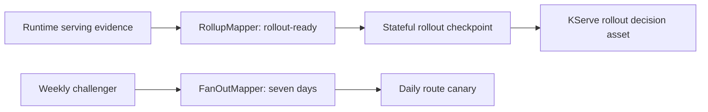

# Airflow 3.3 Stateful KServe Orchestration

This refinement applies Airflow 3.3 state stores, partition mappers, runtime partitioning, and exception-aware retries to progressive KServe rollouts. The DAG module is parsed in CI against `apache-airflow==3.3.0`; the repository does not claim to run a production serving control plane.

## Implemented Evidence

- An executable Task SDK DAG rolls up request-contract, shadow, and route evidence before promotion.
- A bounded `FanOutMapper` converts one weekly challenger partition into seven daily route validations.
- Task state keeps the rollout operation ID across retries; asset state keeps the challenger digest and observed route generation across runs.
- CI imports the module, checks expected DAG IDs, calls `DAG.validate()`, rejects empty DAGs, and runs `pip check`.



## State Boundaries

| Mechanism | Stored | Why |
| --- | --- | --- |
| Task state store | rollout operation ID and progress | reattach after worker failure without applying traffic twice |
| Asset state store | challenger digest and route generation | preserve cross-run rollout identity and rollback evidence |
| External telemetry | latency, errors, route mix, shadow deltas | avoid turning the metadata database into a metrics store |

Only the idempotency-critical operation ID uses `NEVER_EXPIRE`. Large telemetry and model artifacts stay in Prometheus, object storage, MLflow, and OCI registries.

## Failure Semantics

- Connection failures to KServe or Gateway API retry with bounded attempts.
- Authorization failures fail fast and require an operator.
- The saved route generation prevents a retry from silently evaluating a newer route.
- Rollup creates at most one promotion decision; challenger fanout creates at most seven route checks.
- A production rollback must still verify that the previous model is loaded and the route has converged.

## Verification

```bash
make airflow-stateful-orchestration
make airflow-sdk-contract
```

The SDK contract command requires the `airflow33` optional dependency. GitHub Actions uses Airflow's official Python 3.11 constraints.

## Production Boundary

This validates authoring compatibility and deterministic evidence. It does not prove live KServe readiness, Gateway API convergence, scheduler failover, or state-store durability. Those belong in a Minikube/integration-cluster test with real controllers and failure injection.

References: [state-store overview](https://airflow.apache.org/docs/apache-airflow/stable/core-concepts/task-and-asset-state-store.html), [asset partitioning](https://airflow.apache.org/docs/apache-airflow/stable/authoring-and-scheduling/assets.html), [retry policies](https://airflow.apache.org/docs/apache-airflow/stable/core-concepts/tasks.html#retry-policies), and [constrained installation](https://airflow.apache.org/docs/apache-airflow/stable/installation/installing-from-pypi.html).
