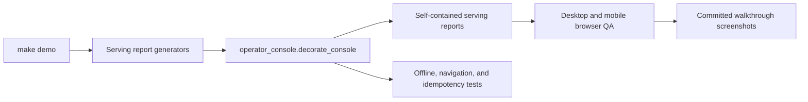

# ServeOps Operator Console

The generated UI is an offline serving console for revision, traffic, latency, and rollback decisions. It deliberately resembles a production control surface rather than a portfolio landing page.

## Design contract

- **Identity:** ServeOps uses graphite, protocol blue, telemetry teal, and rollback orange. Accents distinguish routing, health, and intervention.
- **Shape:** evidence and metrics share ruled frames; panels are matte with minimal radius and no decorative shadow stack.
- **Density:** request contracts, revision state, and route evidence remain scannable at operational desktop widths.
- **Language:** screens describe serving state and actions. Interview guidance stays in the study guide.
- **Offline behavior:** all CSS and Lucide-derived SVG paths are embedded in the generated HTML; there is no CDN or JavaScript framework dependency.
- **Accessibility:** skip navigation, landmarks, active-route semantics, focus-visible controls, reduced-motion handling, and mobile overflow checks are part of the UI contract.

## Information architecture

| Surface | Operational question |
| --- | --- |
| Traffic control | Which revision serves traffic, and can the canary advance? |
| Release review | Are request, rollout, Gateway, and explainability contracts complete? |
| Rollback drill | Can traffic return to the champion without duplicate side effects? |
| Serving signals | How do route, model, SLO, queue, and telemetry evidence connect? |
| Demo runbook | What is the timed sequence for reviewing the serving path? |
| Runtime evidence | Which immutable artifact supports each serving decision? |

## Open-source references

- [Tabler](https://docs.tabler.io/) (MIT) for application-shell anatomy and compact operational components.
- [PatternFly dashboard guidance](https://v5-archive.patternfly.org/patterns/dashboard/design-guidelines/) and [table guidance](https://v4-archive.patternfly.org/v4/components/table/design-guidelines/) for hierarchy and data-dense controls.
- [Grafana dashboard guidance](https://grafana.com/docs/grafana/latest/visualizations/dashboards/build-dashboards/best-practices/) for constrained panels and explicit dashboard intent.
- [Lucide](https://github.com/lucide-icons/lucide) (ISC) for inline navigation and refresh icon paths.

The code does not ship upstream template CSS. The shell and domain-specific layout are original and have no runtime network dependency.

## Review checklist

1. Run `make demo` and open `.local/reports/kserve_serving_dashboard.html`.
2. Verify all six navigation destinations preserve the shell and active state.
3. Check desktop at 1440px and mobile at 390px with no horizontal document overflow.
4. Exercise the traffic review controls and confirm model/version state remains readable without color.
5. Regenerate the six `study-*` screenshots after any layout or copy change.
