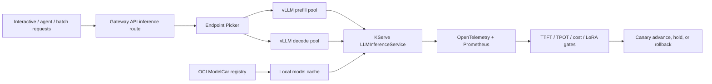

# KServe LLM Inference Readiness

This project now includes a generative-inference readiness slice in addition to the tabular credit-risk serving path. The goal is not to pretend a laptop is a GPU cluster; it is to show how the platform owner would evaluate a production LLM serving rollout before letting it share the same release, routing, and observability control plane.

## What It Demonstrates

- KServe `LLMInferenceService` as the API boundary for generative workloads.
- vLLM as the high-throughput serving runtime.
- OCI ModelCar storage URIs for immutable, cacheable model artifacts.
- Gateway API Inference Extension endpoint picking for model-aware routing.
- Separate prefill/decode capacity planning.
- TTFT and TPOT release budgets.
- Prefix-cache, KV-cache, queue-depth, token, cost, and LoRA adapter telemetry.
- Fail-open routing back to the stable route when endpoint-picker signals are stale.

## Demo Commands

```bash
make llm-inference-readiness
make demo
make ci-verify
```

The generated evidence lives at:

```text
.local/reports/llm_inference_readiness_plan.json
.local/reports/kserve_serving_dashboard.html
```

## Architecture



## Production Boundary

The repo keeps this deterministic for CI. A real deployment would additionally install the KServe generative inference components, configure GPU node pools, publish the ModelCar images with provenance attestations, and connect the endpoint picker to live vLLM metrics.

The important senior-level signal is the control-plane thinking: traffic classes, failure modes, supply-chain constraints, cache strategy, release gates, and observability are modeled before the first large model is exposed to users.
