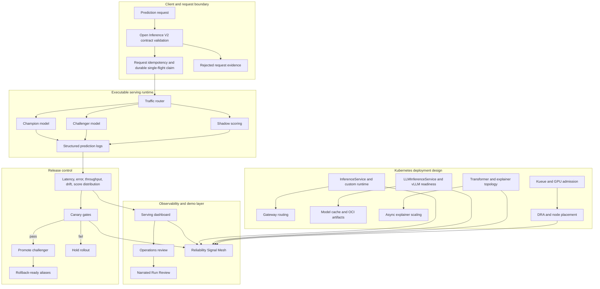

# Study Guide: KServe Model Serving Platform

This guide explains the complete serving system, the screenshots to review, and the production ideas each artifact demonstrates.

The generated app follows the tested [ServeOps design contract](design-system.md), including its offline rendering, accessibility, and responsive QA rules.

## Full Architecture



The executable core is the local Open Inference V2 runtime and deterministic release state. The Kubernetes assets explain how the same controls map to KServe, Gateway API, Kueue, DRA, and model-cache operations.

## Screenshot Walkthrough

Fresh browser-verified captures from the generated app are available as a linear demo path:

| Step | Screenshot | What it proves |
| --- | --- | --- |
| 0 | `docs/screenshots/study-00-artifact-index.png` | The generated artifact index gives operators one launch point. |
| 1 | `docs/screenshots/study-01-main-dashboard.png` | The serving dashboard is readable end to end. |
| 2 | `docs/screenshots/study-02-judge-cockpit.png` | The operations review groups evidence by operational concern. |
| 3 | `docs/screenshots/study-03-operator-drill.png` | Serving failure recovery is rehearsed as an operator workflow. |
| 4 | `docs/screenshots/study-04-reliability-signal-mesh.png` | Serving signals are tied to orchestration and release decisions. |
| 5 | `docs/screenshots/study-05-narrated-demo-studio.png` | The narration and video plan can be reviewed without running tools. |

1. **Serving dashboard**: `docs/screenshots/dashboard.png`
   Shows model versions, traffic split, prediction logs, canary decision, and serving metrics.

2. **Gateway and live inference lab** in the main dashboard
   Demonstrates request routing, idempotency evidence, runtime status, and V2 request behavior.

3. **LLM readiness panel** in the main dashboard
   Explains vLLM, ModelCar/OCI artifacts, TTFT/TPOT gates, endpoint picking, and cache-aware rollout.

4. **Transformer/explainer readiness** in the main dashboard
   Shows how predictor health, transformer latency, async explainer scaling, and fallback routes are controlled.

5. **Operations review**: `docs/screenshots/study-02-judge-cockpit.png`
   The recommended reviewer entry point for seeing release, observability, governance, and operator handoff together.

6. **Operator drill lab**: `docs/screenshots/dashboard-operator-drill.png`
   Walks through a serving incident: detect, hold, explain, recover, and document.

7. **Reliability Signal Mesh**: `docs/screenshots/dashboard-reliability-signal-mesh.png`
   Connects serving health with orchestration events, resource pressure, and release admission.

8. **Narrated Run Review**: `docs/screenshots/dashboard-narrated-demo-studio.png`
   Provides the voice/video plan, subtitles, and Remotion props for a polished demo.

9. **Mobile capture**: `docs/screenshots/dashboard-mobile.png`
   Prove that the app remains reviewable on narrow screens.

## How To Study The Code

| Area | Files | What to learn |
| --- | --- | --- |
| Serving runtime | `api.py`, `runtime_state.py`, `runtime_contract.py`, `v2_protocol.py` | Open Inference V2, health checks, concurrency, idempotency |
| Model release | `models.py`, `serving.py`, `rollout_control.py`, `monitoring.py` | Champion/challenger routing, shadow scoring, rollback |
| KServe readiness | `llm_inference_readiness.py`, `transformer_explainer_readiness.py`, `model_cache.py`, `inference_gateway.py` | Serving topology and production KServe trade-offs |
| Reliability | `reliability_signal_mesh.py`, `operational_readiness.py`, `slo.py`, `cost_observability.py` | How serving metrics become release decisions |
| Operator UI | `operator_console.py`, `dashboard.py`, `demo_cockpit.py`, `narrated_demo_studio.py`, `artifact_index.py` | Shared shell, offline reports, responsive behavior, and serving evidence navigation |

## Commands To Reproduce

```bash
make demo
make test
make ci-verify
open .local/reports/index.html
open .local/reports/kserve_serving_dashboard.html
open .local/reports/narrated_demo_studio.html
```

To exercise the HTTP runtime:

```bash
make api-run
make api-smoke
```

## Interview Talking Points

- **Serving is not just prediction.** Production serving includes request contracts, idempotency, deadline handling, model versioning, rollback, and evidence.
- **Canary gates must be measurable.** Promotion depends on latency, error rate, route mix, drift, and shadow comparison rather than confidence alone.
- **Rollback needs state discipline.** The runtime keeps last-known-good snapshots and durable request identity so retries do not corrupt the release story.
- **KServe adds operational contracts.** InferenceService manifests, custom runtimes, transformers, explainers, LLM endpoints, and model caches all create new failure modes.
- **Observability drives action.** Metrics are tied to hold/promote/rollback decisions, not just charts.

## Learning Outcomes

After studying this repository, you should be able to explain Open Inference V2 serving, champion/challenger rollout, shadow traffic, idempotent prediction APIs, KServe deployment topology, LLM serving readiness, and the difference between a demo endpoint and a production serving control plane.
